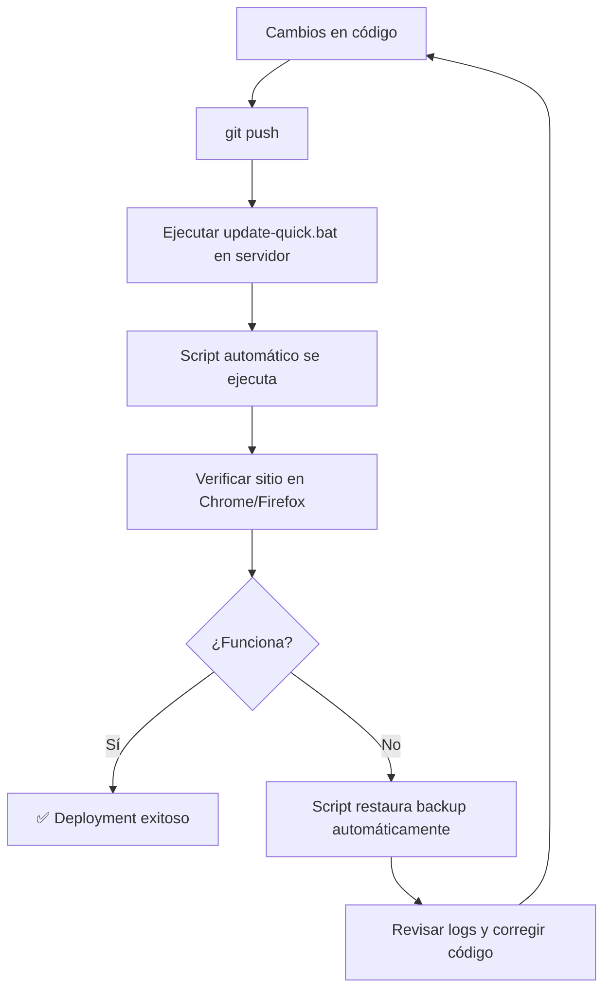

# 📋 METODOLOGÍA CORRECTA PARA ACTUALIZACIONES
## DIRIS Lima Norte - Landing Page

## 🎯 **RESUMEN DE PROBLEMAS IDENTIFICADOS**

### ❌ **Lo que estaba causando dificultades:**
1. **Múltiples configuraciones conflictivas** (next.config.iis.ts, next.config.github.ts, etc.)
2. **Proceso manual propenso a errores** (copiar archivos manualmente)
3. **Inconsistencias en basePath** entre diferentes builds
4. **Modificaciones manuales del web.config** que causaban errores XML
5. **No había validaciones automáticas** del proceso

## ✅ **SOLUCIÓN IMPLEMENTADA**

### 🔧 **Scripts de Automatización Creados:**
- `update-from-github.ps1` - Script completo con validaciones
- `update-quick.bat` - Acceso rápido para uso diario
- `DEPLOYMENT-GUIDE.md` - Documentación completa

### 📁 **Archivos Estandarizados:**
- `web.config` - Configuración optimizada para Chrome/Firefox
- `next.config.ts` - Configuración única y consistente para IIS

---

## 🚀 **PROCESO CORRECTO PASO A PASO**

### **EN TU MÁQUINA LOCAL (Desarrollo):**

#### 1. **Hacer cambios al código**
```bash
# Editar archivos en src/, components/, etc.
# NO modificar next.config.ts
# NO modificar web.config
```

#### 2. **Probar localmente (opcional pero recomendado)**
```bash
npm run build
npm run start
# Verificar que funciona correctamente
```

#### 3. **Subir a GitHub**
```bash
git add .
git commit -m "feat: descripción del cambio"
git push origin master
```

### **EN EL SERVIDOR (Producción):**

#### 4. **Ejecutar actualización automática**
```cmd
# Opción 1: Script rápido
update-quick.bat

# Opción 2: Script completo
powershell -ExecutionPolicy Bypass -File update-from-github.ps1
```

#### 5. **Verificar resultado**
- ✅ **Chrome**: `http://localhost/page_ofseg_dirisln/`
- ✅ **Firefox**: `http://localhost/page_ofseg_dirisln/`
- 🧪 **Diagnóstico**: `http://localhost/page_ofseg_dirisln/browser-test.html`

---

## 🛠️ **QUÉ HACE EL SCRIPT AUTOMÁTICAMENTE**

### ✅ **Seguridad:**
- Crea backup automático de la versión actual
- Valida archivos críticos antes de aplicar cambios
- Restaura backup automáticamente si algo falla

### ✅ **Build Process:**
- Descarga última versión desde GitHub
- Configura automáticamente para IIS
- Instala dependencias npm
- Ejecuta build de Next.js
- Valida archivos generados

### ✅ **Deployment:**
- Copia archivos del directorio `out/`
- Preserva web.config válido
- Verifica sintaxis XML
- Crea log detallado del proceso

### ✅ **Validaciones:**
- Verifica que index.html no es página 404
- Cuenta archivos CSS y JS generados
- Valida configuración IIS
- Genera reporte de status

---

## 📊 **BENEFICIOS DE ESTA METODOLOGÍA**

### 🎯 **Consistencia:**
- **Mismo proceso cada vez** - elimina errores humanos
- **Configuración única** - no más conflictos entre ambientes
- **Validaciones automáticas** - detecta problemas antes de deployment

### ⏱️ **Velocidad:**
- **Proceso automatizado** - de 20+ minutos a 2-3 minutos
- **Sin pasos manuales** - solo ejecutar un script
- **Rollback automático** - restaura si algo falla

### 🔒 **Seguridad:**
- **Backups automáticos** - nunca perder versión funcional
- **Validación XML** - previene errores 500.19
- **Verificación de archivos** - asegura deployment completo

---

## 🔄 **FLUJO RECOMENDADO PARA FUTURAS ACTUALIZACIONES**



---

## 📝 **REGLAS DE ORO**

### ✅ **HACER:**
- Usar `update-quick.bat` para todas las actualizaciones
- Verificar sitio en ambos navegadores después de update
- Revisar `deployment-log.txt` si hay problemas
- Hacer commits descriptivos en GitHub

### ❌ **NO HACER:**
- Modificar `web.config` manualmente
- Cambiar `next.config.ts` sin entender el impacto
- Copiar archivos manualmente desde `/out/`
- Saltarse el proceso de validation

---

## 🎉 **RESULTADO FINAL**

**Antes**: 20+ minutos, propenso a errores, proceso manual complejo
**Ahora**: 2-3 minutos, automatizado, con validaciones y rollback

¿Quieres probar el nuevo proceso con algún cambio pequeño para verificar que funciona perfectamente?
